# SONY KBD-13 KEYBOARD EMULATOR

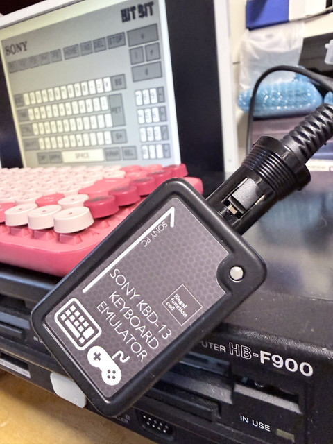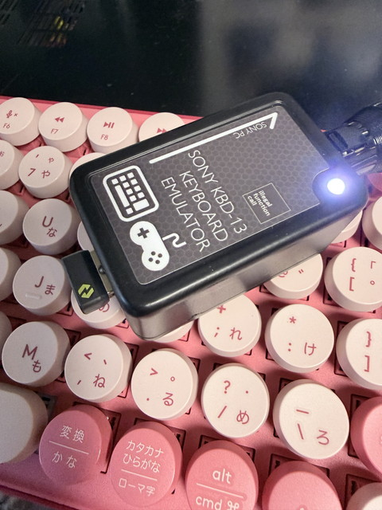

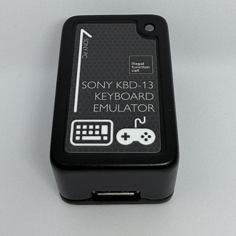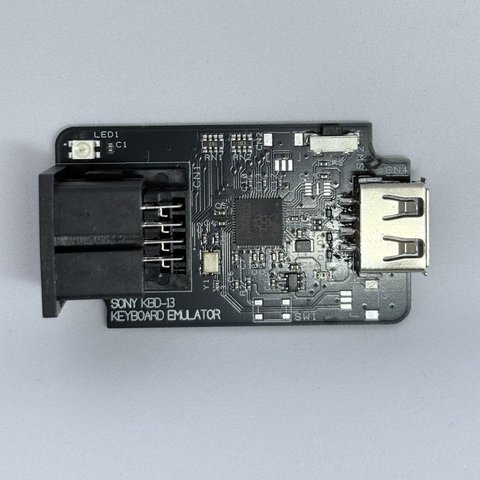

## これは何？

RP2350を使った **SONY KBD-13 KEYBOARD EMULATOR**、SONY MSX/MSX2 HB-701/HB-F500/HB-F900用 USB Keyboard Converterです。  
USBキーボードまたはUSBゲームパッドをUSB Host端子へ接続することで、接続先本体のキーマトリクスへキー入力を出力します。

USBメモリをUSB Hostへ接続すると、内部フラッシュに保存している設定ファイルをコピーし、PC上でキーボード設定/ゲームパッド設定を変更できます。  
特注のDIN13pinゲーブルの入手ができたことにより製造できました。

## 特徴

- **USB HIDキーボード**をHB-F500キーマトリクスへ変換
- **USB HIDゲームパッド**のボタン、ハットスイッチ、アナログスティックをキーマトリクスへ変換
- 接続したUSB機器の**VID/PIDごとに設定プロファイルを自動選択**
- **USBメモリ経由**でキーボード/ゲームパッドの設定JSONを編集可能
- 本体内蔵フラッシュへ設定を保存するため、通常利用時にUSBメモリは不要
- CAPS/KANA(NumLock相当)信号を受け、接続USBキーボードのLED出力へ反映
- BOOTSELボタンの5秒長押しによる設定ファイルの初期化

## パッケージ内容

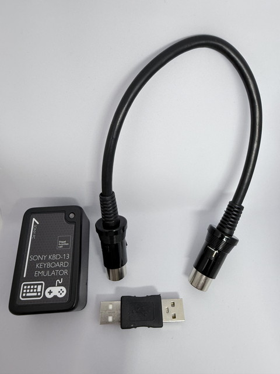

1. KBD-13 EMULATOR: 変換器本体です。  
2. 接続ケーブル: MSX本体と接続するケーブルです。  
3. USB-Aアダプタ: Firmware Updateで使用するアダプタです。

## 本体説明

1. USB Host端子: USBキーボード、USBゲームパッド、または設定変更用USBメモリを接続します。  
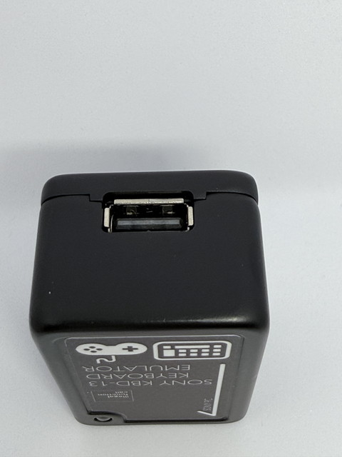  

2. HB-F500接続端子: 接続先本体のキーマトリクス信号へ接続します。  
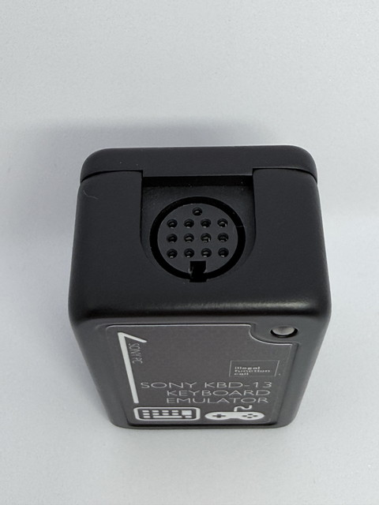

3. BOOTSELスイッチ: 本体の横にある穴の中にあります。通常動作中に5秒間長押しすると、内蔵設定を初期状態へ戻します。  
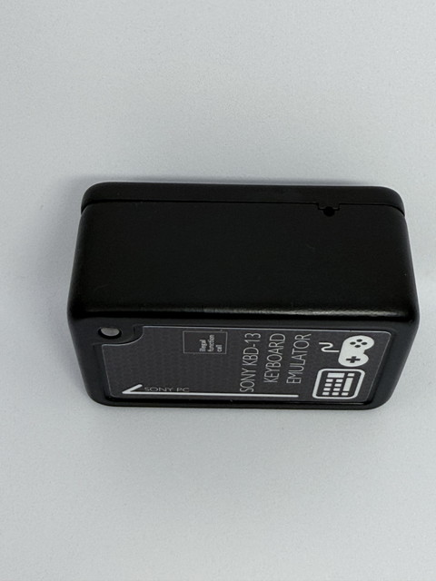

4. LED: 待機、機器接続、ファイル操作、異常などの状態表示します。  


## 対応について

本ファームウェアは、HB-F500系の外部キーボードインターフェースへ接続することを前提にしています。  
USB機器側は標準的なHID Boot Keyboardおよび一般的なHIDゲームパッドを対象とします。  
すべてのUSB機器、複合デバイス、独自Report Descriptorを使用する製品での動作を保証するものではありません。

## 動作確認済USB機器

|種類|メーカー名|商品名|型番|
|---|---|---|---|
|キーボード|ロジクール|K270ワイヤレス キーボード|K270|
|キーボード|ロジクール|POP KEYS メカニカルワイヤレスキーボード|K730|
|キーボード|ロジクール|ワイヤレスコンボ MK245 NANO|MK245nBK|
|キーボード|HP|HP USB Business Slim Keyboard|KU-1469|
|キーボード|HP|HP 230 Wireless Keyboard|HSA-A005K|
|キーボード|Lenovo|不明USBキーボード|KU-01696|
|キーボード|瑞起|X68000 Z キーボード（グレー）|ZKXZ-003-GR|
|ゲームパッド|任天堂|Nintendo Switch Proコントローラー|HAC-013|
|ゲームパッド|エレコム|12ボタンUSBゲームパッド|JC-U2912FWH|
|ゲームパッド|エレコム|ELECOM GAMING 有線スタンダードゲームパッド GP20S|JC-GP20SBK|
|ゲームパッド|ソニー・インタラクティブエンタテインメント|ワイヤレスコントローラー（DUALSHOCK 4）|CUH-ZCT2J|
|ゲームパッド|セガ・ロジスティクスサービス|復刻版セガサターン コントロールパッド|ISS-5001-02|
|ゲームパッド|ソニー・インタラクティブエンタテインメント|プレイステーション クラシック コントローラー|SCPH-1000R|
|ゲームパッド|ロジクール|F710 ワイヤレスゲームパッド|F710|
|ゲームパッド|セガ|3ボタンコントロールパッド|HAA-2521|
|ゲームパッド|セガ|ファイティングパッド6B|HAA-2522|
|ゲームパッド|コナミデジタルエンタテインメント|PCエンジン mini 専用コントローラー|不明|

## 技術資料

### USBメモリによる設定更新

USBメモリを接続すると下記設定ファイルコピーします。

```text
KEYMAP0.JSN - KEYMAP3.JSN
GPADMAP0.JSN - GPADMAP4.JSN
VIDCFG.INI
```

USBメモリ上でファイルを変更した後に再度本機に接続すると、変更されたファイルを反映します。  
設定を初期状態へ戻したい場合は、USBメモリのルートへ空の`resetdef.txt`を置いて接続するか、BOOTSELを5秒間長押しします。

> [!CAUTION]
> 設定コピー中はUSBメモリを取り外さないでください。ファイルエラーや設定破損の原因になります。

### キーボード設定 JSON

キーボード設定は`KEYMAP0.JSN`から`KEYMAP3.JSN`です。  
各ファイルは32KByte以下とし、ルートの`Keymap`内に`Modifier`、`Usage`、`ASCII`配列を置きます。

|セクション|用途|Id|
|---|---|---|
|`Modifier`|Ctrl、Shift、Altなどの修飾キー|USB HID modifierビット値。例: `"0x02"`=Left Shift|
|`Usage`|通常のキーボードキー|USB HID Usage ID。例: `"0x04"`=A|
|`ASCII`|文字列送出用ASCII文字|ASCIIコード。例: `"0x41"`=A|

各エントリは次の形式です。

```json
{
  "Y": [3, 0],
  "Mask": [64, 0],
  "Id": "0x04",
  "Name": "Key A"
}
```

- `Y`: 接続先本体のキーマトリクスY番号です。JSONでは`1-12`を指定します。内部実装のY0-Y11に対して、JSONのY1-Y12がそれぞれ対応します。未割り当てには`Y`と`Mask`をともに`0`にします。  
- `Mask`: 当該Y行のX列を示すビット値です。`1, 2, 4, 8, 16, 32, 64, 128`を指定します。`Mask=1`がX0、`Mask=128`がX7です。  
- `Id`: `Modifier`と`Usage`はUSB HIDコード、`ASCII`はASCIIコードを指定します。文字列は`0x`付き16進表記または数値表記を使用します。  
- `Name`: コメント用のキー名です。動作には使用しません。  
- `Y`と`Mask`は配列で最大2組まで指定できます。1回の入力で複数のマトリクス位置を同時に操作する場合に使用します。

### キーマトリクス Y / Mask 対応表

設定JSONの`Y`と`Mask`は、下表のマトリクス位置を指定します。  
`Y`はJSONに記述する番号、`Mask`はX列を表すビット値です。`Mask=1`がX0、`Mask=2`がX1、`Mask=4`がX2、`Mask=8`がX3、`Mask=16`がX4、`Mask=32`がX5、`Mask=64`がX6、`Mask=128`がX7です。

|JSON Y|内部Y|Mask 1|Mask 2|Mask 4|Mask 8|Mask 16|Mask 32|Mask 64|Mask 128|
|---:|---:|---|---|---|---|---|---|---|---|
|1|Y0|0|1|2|3|4|5|6|7|
|2|Y1|8|9|-|^|\\|@|[|+|
|3|Y2|*|]|<|>|/|_|A|B|
|4|Y3|C|D|E|F|G|H|I|J|
|5|Y4|K|L|M|N|O|P|Q|R|
|6|Y5|S|T|U|V|W|X|Y|Z|
|7|Y6|SHIFT|CTRL|GRAPH|CAPS|KANA|F1|F2|F3|
|8|Y7|F4|F5|ESC|TAB|STOP|BS|SELECT|RETURN|
|9|Y8|SPACE|CLS|INS|DEL|LEFT|UP|DOWN|RIGHT|
|10|Y9|テンキー *|テンキー +|テンキー /|テンキー 0|テンキー 1|テンキー 2|テンキー 3|テンキー 4|
|11|Y10|テンキー 5|テンキー 6|テンキー 7|テンキー 8|テンキー 9|テンキー -|テンキー ,|テンキー .|
|12|Y11|未使用|JIKKOU|未使用|TORIKESHI|未使用|未使用|未使用|未使用|

この表は`KBD-13_EMU.cpp`の`kMsxKeyNameTable`を元にしています。  
実装上、Y13以降はHB-F500キーマトリクス出力の対象外です。設定コメントに記載されているPAUSE/RESET用の番号は、現在のファームウェアでは出力先として実装されていません。  
同梱の既定JSONは上表のビット値形式です。設定ファイルを編集する場合も、この形式を使用してください。  
なお、現在の`matrix_action_emit()`実装は`Mask`をX列番号として扱う処理を含むため、既定JSONのビット値形式と一致しない箇所があります。この点はファームウェア側で整理予定の既知の実装差異です。

最小例:

```json
{
  "Keymap": {
    "Modifier": [
      { "Y": [7, 0], "Mask": [1, 0], "Id": "0x02", "Name": "L Shift" }
    ],
    "Usage": [
      { "Y": [3, 0], "Mask": [64, 0], "Id": "0x04", "Name": "Key A" }
    ],
    "ASCII": [
      { "Y": [3, 0], "Mask": [64, 0], "Id": "0x41", "Name": "A" }
    ]
  }
}
```

`ASCII`は、プロファイル切替通知、ファームウェアバージョン表示、対向試験の文字列送出で使用します。  
通常のUSBキーボード入力だけを使用する場合でも、既存ファイルから`ASCII`セクションを削除しないでください。

### ゲームパッド設定 JSON

ゲームパッド設定は`GPADMAP0.JSN`から`GPADMAP4.JSN`です。  
`Keymap.GamePad`配列を使用します。旧形式との互換性のため、`Keymap.Usage`配列も読込み可能です。

ボタンの例:

```json
{
  "Y": [9, 0],
  "Mask": [1, 0],
  "Id": "Button0",
  "Name": "Key SPACE"
}
```

ハットスイッチの`Id`は次を使用します。

```text
HatSwitch_U
HatSwitch_D
HatSwitch_L
HatSwitch_R
```

アナログスティックの`Id`は`Axis0`から`Axis8`です。`Value`へ`-1.0`から`1.0`のしきい値を指定します。

```json
{
  "Y": [9, 0],
  "Mask": [128, 0],
  "Id": "Axis0",
  "Value": 0.6,
  "Name": "Right"
}
```

- `Value`が正数: 軸値が指定値以上で押下します。  
- `Value`が負数: 軸値が指定値以下で押下します。  
- `Button0`から`Button12`、ハット、各Axisはそれぞれ個別に設定できます。  
- `Y`と`Mask`の意味はキーボード設定と同じです。

### VIDCFG.INI

`VIDCFG.INI`は、接続したUSB機器のVID/PIDに対して使用するプロファイルを記録するCSV形式のファイルです。

```text
# VID(hex),PID(hex),ProfileFileName
046D,C31C,KEYMAP1.JSN
1234,5678,GPADMAP0.JSN
```

- キーボードには`KEYMAP0.JSN`から`KEYMAP3.JSN`を指定します。  
- ゲームパッドには`GPADMAP0.JSN`から`GPADMAP4.JSN`を指定します。  
- 未登録のUSB機器を初めて接続した場合は、キーボードは`KEYMAP0.JSN`、ゲームパッドは`GPADMAP0.JSN`として自動登録されます。  
- 同じVID/PIDへキーボード用とゲームパッド用の両方を登録できます。プロファイル種別ごとに管理されます。

### キーボードからのプロファイル選択

接続したUSBキーボードで、`Left Shift + Left Ctrl + Left Alt`を押しながら次のキーを5秒間保持すると設定モードへ入ります。

|キー|動作|
|---|---|
|Q|`KEYMAP0.JSN`を選択|
|W|`KEYMAP1.JSN`を選択|
|E|`KEYMAP2.JSN`を選択|
|R|`KEYMAP3.JSN`を選択|
|V|ファームウェアバージョンを接続先本体へ文字列出力|
|I|キーIDダンプのON/OFF|

プロファイルを選択すると、接続中キーボードのVID/PIDと選択した`KEYMAP?.JSN`の対応を`VIDCFG.INI`へ保存します。

## ファームウェアについて

コンパイル済みファームウェアは、ビルド後に次の場所へ生成されます。

```text
examples/build/KBD-13_EMU/KBD-13_EMU.uf2
```

## ファームウェアアップデートについて

BOOTSELスイッチを押しながらUSBをPCに接続すると、RP2350のBOOTモードになります。  
PCへRP2350のドライブが表示されるので、`KBD-13_EMU.uf2`をコピーしてください。

アップデート時は付属のUSB-Aアダプタを使用してください。

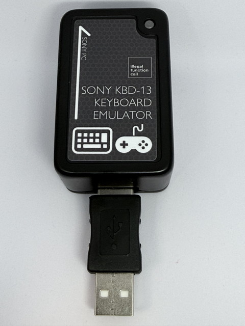

### ピン割り当て

|信号|RP2350 GPIO|説明|
|---|---:|---|
|DAT0-DAT7|GPIO3-GPIO10|HB-F500キーマトリクス データ線。LowまたはHi-Z方式で駆動します。|
|CS|GPIO11|キーマトリクス選択信号。Low activeです。|
|CAPS|GPIO12|本体からのCAPS LED信号入力。Low activeです。|
|KANA/NUM|GPIO13|本体からのKANA/NUM LED信号入力。Low activeです。|
|WS2812|GPIO2|動作状態表示。|
|UART0 TX|GPIO0|デバッグログ出力。|
|UART0 RX|GPIO1|UART入力。|

DAT0-DAT7は通常のPush-Pull出力ではありません。HighはHi-Zとプルアップで表現し、Lowだけを能動的に出力します。  
接続先本体および対向試験機との出力競合を避けるため、配線や変換回路を変更する場合もこの方式を維持してください。

### ファイル構成（概要）

- `KBD-13_EMU.cpp`
  - USB Hostキーボード/ゲームパッド処理
  - HB-F500キーマトリクス出力
  - LFS/FATを使用した設定ファイル同期
  - JSON設定ファイルの解析
  - WS2812状態表示、UARTログ、BOOTSEL長押し初期化
- `keymap1.h` - `keymap4.h`
  - 初期KEYMAP JSON定義
- `gpadmap0.h` - `gpadmap4.h`
  - 初期GPADMAP JSON定義
- `GPADMAP0.JSN`
  - USBメモリ編集用のゲームパッド設定例
- `tusb_config.h`
  - TinyUSB Host設定
- `hbf500_dat_bus.pio`
  - HB-F500データバス制御用PIOプログラム
- `ws2812.pio`
  - WS2812制御用PIOプログラム

### ビルド

Visual Studio CodeのPico SDK環境、またはCMake/Ninjaでコンパイルします。  
TinyUSBおよびpico-jxglibはCMake構成時に`build/_deps`へGit取得され、プロジェクト側のオーバーライドが適用されます。

```powershell
cmake -S examples -B examples/build -G Ninja
cmake --build examples/build --target KBD-13_EMU -j 2
```

## 回路図

[回路図PDF](./PCB/sch000.pdf)  
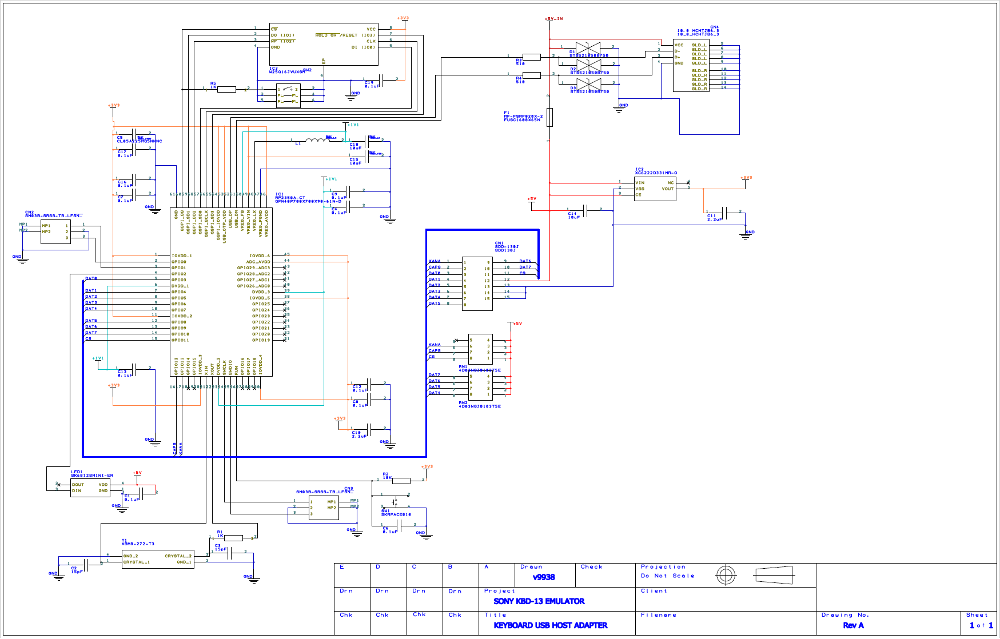

## PCBデータ

[PCBガーバデータ 一式](./PCB/GBR/gerber.zip)
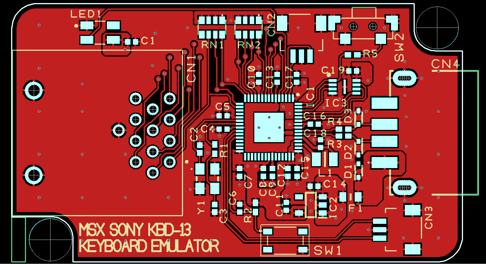

## ライセンス

本プロジェクトのライセンスは、MITライセンスです。  
本製品のソースコードにはGithub Copilotによる生成物が含まれます。  
コードの一部にはRaspberry Pi Pico SDK、pico-jxglibおよびTinyUSB由来のコードを含みます。各依存ライブラリのライセンス条件にも従ってください。

## 謝辞と外部ライブラリ

SONY KBD-13 KEYBOARD EMULATORは、次のオープンソースソフトウェアを使用しています。開発者およびコントリビューターの皆様に感謝します。

### pico-jxglib

- プロジェクト: [pico-jxglib](https://github.com/ypsitau/pico-jxglib)
- Copyright (c) 2025-2026 ypsitau
- License: MIT License
- 本プロジェクトでの用途: USB Host HID、FAT/USB MSC、LFS Flash、JSON、シリアル関連機能

### TinyUSB

- プロジェクト: [TinyUSB](https://github.com/hathach/tinyusb)
- Copyright (c) 2012-2026 hathach (tinyusb.org)
- License: MIT License
- 本プロジェクトでの用途: RP2350向けUSB HostスタックおよびHID/MSCクラス処理
